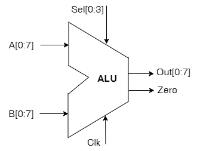
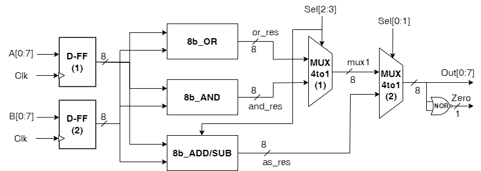
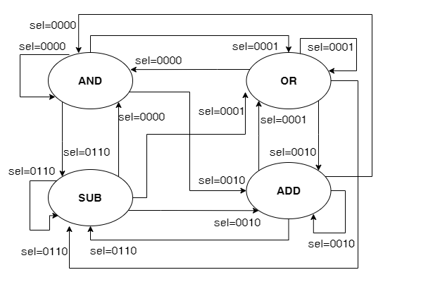

# VLSI Mini Project: ALU Logic Design

## Interface

### Description of signals in ALU:

| Signal | Width | In/Out | Description                                                      |
| ------ | ----- | ------ | ---------------------------------------------------------------- |
| Clock  | 1     | In     | A positive edge clock signal used to operate state’s transition. |
| A      | 8     | In     | The first operand of ALU                                         |
| B      | 8     | In     | The second operand of ALU                                        |
| Sel    | 4     | In     | Control signal used to select operator (Add, subtract, and, or)  |
| Out    | 8     | Out    | The result of ALU after performing selected operation            |
| Zero   | 1     | Out    | The zero flag activated when the output result equals 0          |

## Functional Implementation

The ALU (Arithmetic Logic Unit) is capable of performing 8-bit operations, including arithmetic addition and subtraction, as well as bitwise AND and OR operations.

Inputs:

- Input A (8 bits)
- Input B (8 bits)
- Control Signal (4 bits)

Outputs:

- Output Result (8 bits)
- Zero Flag (1 bit)

Operation Control Value Mapping:

- ADD: 0010
- SUB: 0110
- AND: 0000
- OR: 0001

## Internal Implementation

### Block diagram of ALU Description:

| Name         | Type        | Description                                                                                                                                                                                                         |
| ------------ | ----------- | ------------------------------------------------------------------------------------------------------------------------------------------------------------------------------------------------------------------- |
| A            | Input       | Operand 1                                                                                                                                                                                                           |
| B            | Input       | Operand 2                                                                                                                                                                                                           |
| Clk          | Input       | Clock signal (postedge)                                                                                                       |
| result       | Reg         | Result of the calculation within select signal                                                                         |
| Out          | Output      | Final output result of ALU                                                                                                                                                                                          |
| Zero         | Output      | The zero flag. This equals 1 when ouput is 0.                                                                                                                                                                       |
| 8b_AND       | Logic Block | This is a digital logic component that takes two 8-bit binary inputs and produces a 8-bit output where each bit represents the result of performing a bitwise AND operation on the corresponding bits of the input. |
| 8b_OR        | Logic Block | This is a digital logic component that takes two 8-bit binary inputs and produces a 8-bit output where each bit represents the result of performing a bitwise OR operation on the corresponding bits of the input.  |
| 8b_ADD   | Logic Block | A digital logic component capable of performing addition operations on two 8-bit binary numbers based on the select signal.                                                                    |
| 8b_ADD   | Logic Block | A digital logic component capable of performing subtraction operations on two 8-bit binary numbers based on the select signal.                                                                    |
| MUX | Logic Block | A multiplexer with 4 data inputs, 1 select input, and 1 output, which selects one of the data inputs based on the select input.   |
| NOR          | Logic Block | A digital logic gate that performs the logical NOR operation which ouput is true when none of inputs are true.                                                                                                      |

## State Machine

### The variable name of the state machine

|     Variable name    |     Description           |
|----------------------|---------------------------|
|     sel              | The control signal of ALU |

### The state of the state machine

|     State    |     Description                |
|--------------|--------------------------------|
| AND          | Logical AND operation          |
| OR           | Logical OR operations          |
| ADD          | Arithmetic operation ADD       |
| AUB          | Arithmetic operation SUBSTRACT |